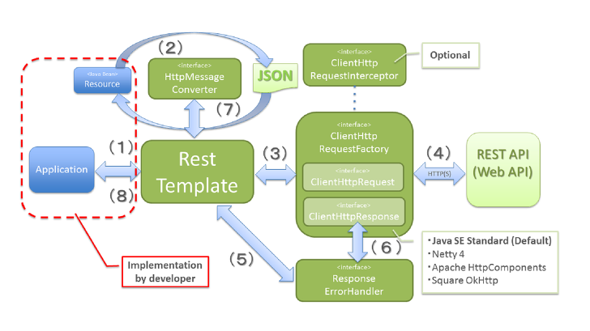

# RestTemplate
### RestTemplate이란?
 spring 3.0 부터 지원한다. 
 스프링에서 제공하는 http 통신에 유용하게 쓸 수 있는 템플릿이며,HTTP 서버와의 통신을 단순화하고 RESTful 원칙을 지킨다. 
 jdbcTemplate 처럼 RestTemplate 도 기계적이고 반복적인 코드들을 깔끔하게 정리해준다.  

####특징
- 기계적이고 반복적인 코드를 최대한 줄여줌
- RESTful형식에 맞춤
- json, xml 를 쉽게 응답받음

### RestTemplate 의 동작원리
org.springframework.http.client 패키지에 있다. HttpClient는 HTTP를 사용하여 통신하는 범용 라이브러리이고, 
RestTemplate은 HttpClient 를 추상화(HttpEntity의 json, xml 등)해서 제공해준다. 
 따라서 내부 통신(HTTP 커넥션)에 있어서는 Apache HttpComponents 를 사용한다. 만약 RestTemplate 가 없었다면, 
 직접 json, xml 라이브러리를 사용해서 변환해야 했을 것이다. 
 
 

1. 어플리케이션이 RestTemplate를 생성하고, URI, HTTP메소드 등의 헤더를 담아 요청한다.
2. RestTemplate 는 HttpMessageConverter 를 사용하여 requestEntity 를 요청메세지로 변환한다.
3. RestTemplate 는 ClientHttpRequestFactory 로 부터 ClientHttpRequest 를 가져와서 요청을 보낸다.
4. ClientHttpRequest 는 요청메세지를 만들어 HTTP 프로토콜을 통해 서버와 통신한다.
5. RestTemplate 는 ResponseErrorHandler 로 오류를 확인하고 있다면 처리로직을 태운다.
6. ResponseErrorHandler 는 오류가 있다면 ClientHttpResponse 에서 응답데이터를 가져와서 처리한다.
7. RestTemplate 는 HttpMessageConverter 를 이용해서 응답메세지를 java object(Class responseType) 로 변환한다.
8. 어플리케이션에 반환된다.

---
간단한 RestTemplate 예제를 만들어 보겠다.

회원가입을 확인하는 API를 제작한다고 가정을 해보자. 

이름과 핸드폰 번호를 받는 API와 회원가입을 등록하는 API가 있다. 

이름과 핸드폰 번호가 둘다 있으면 회원가입을 하는 API를 호출, 
 
  핸드폰 번호가 없으면 가입실패를 리턴 
 
   

